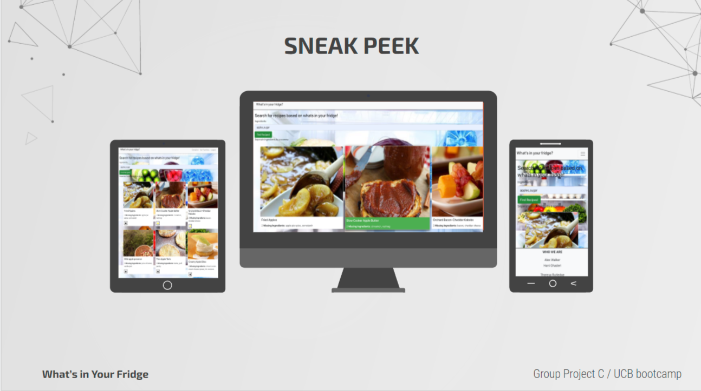

# What's in Your Fridge

## Description

We want to provide a single site for users to post and share their favorite recipes with all our subscribers.

As a subscriber to our site, they can upload several recipes by defining recipes' names, ingredients, brief cooking instructions, and alluring pictures of their favorite foods.

Users based on available ingredients on the fridge can come up with their recipes.

When they are browsing the site, they can learn new recipes shared by other subcarriers.

They can decide to endorse a recipe and comment on the site to let everyone know about their amazing experience of cooking and eating their new favorite food.

Users can donate \$20 to SF Marin Food Bank

## Table of Contents

- [Contribution](#contribution)
- [Screenshot](#screenshot)
- [License](#license)
- [Badges](#badges)
- [GitHub](#github)
- [Heroku](#heroku)

## Screenshot

## Contribution

Made with ❤️ by Alex Walker, Hani Ghaderi, Theresa Rutledge, and Ruohan Wang

## License

MIT

## Badges

## GitHub

My GitHub link: (https://github.com/rhw-git/book-search-engine)

## Heroku

My Heroku link: (https://whats-in-your-fridge-project3.herokuapp.com/)
